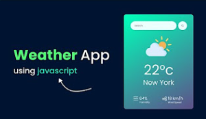
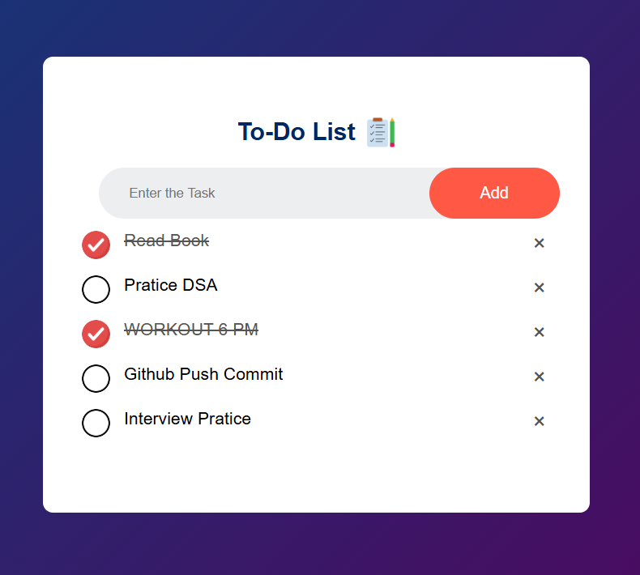
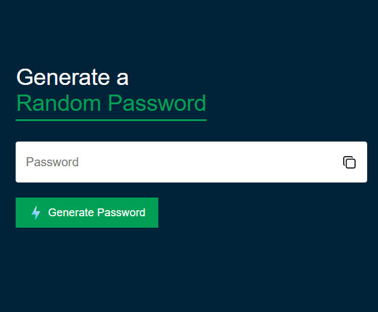

# 30+ Frontend Projects (HTML • CSS • JavaScript)

This repo contains mini projects built using HTML, CSS, and JavaScript—based.


##  Projects List

| #  | Project Name        | Demo Link                                                                 | Screenshot                              |
|----|---------------------|---------------------------------------------------------------------------|-----------------------------------------|
| 1  | **Weather App**  | **👉(https://azampasha-weather-app.netlify.app/)** |      |
| 2  | **To-do-app**  | **👉(https://azam-to-do-list-app.netlify.app/)**|      |
| 3  | **Quiz App**  | **👉(https://azam-quiz-app.netlify.app/)**|      |
| 4  | **Random Password Genertor**  | **👉(https://random-passowrd-by-azam.netlify.app/)**|      |

##  How to Run Locally

Each project folder contains its own HTML, CSS, and JavaScript:

```bash
cd Project-01-Name
open index.html  # or simply double-click the file
