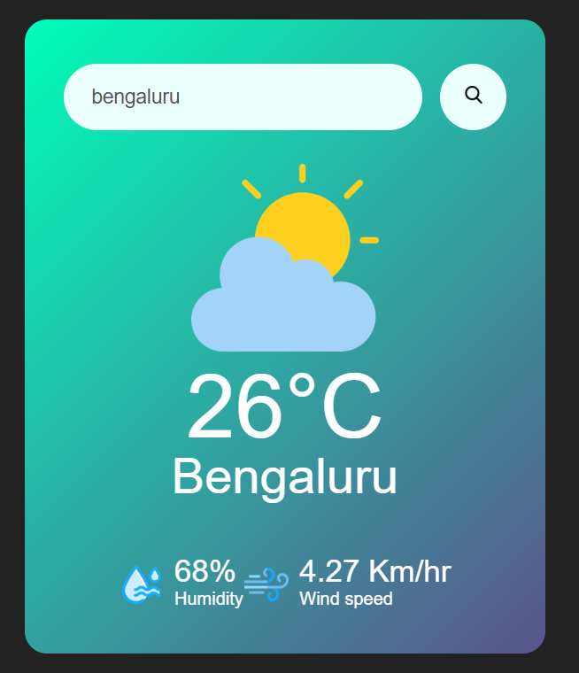

# 30plus-frontend-projects
# 30+ Frontend Projects (HTML • CSS • JavaScript)

This repo contains mini projects built using HTML, CSS, and JavaScript—based.


##  Projects List

| #  | Project Name        | Demo Link                                                                 | Description                   | Screenshot                              |
|----|---------------------|---------------------------------------------------------------------------|-------------------------------|-----------------------------------------|
| 1  | **Project 1 Name**  | `[Live Demo](https://username.github.io/30-frontend-projects/Project-01-Name/)` | One-line description here     |      |
| 2  | **Project 2 Name**  | `[Live Demo](https://username.github.io/30-frontend-projects/Project-02-Name/)` | One-line description here     |      |
| 3  | **Project 3 Name**  | `[Live Demo](https://username.github.io/30-frontend-projects/Project-03-Name/)` | One-line description here     |      |


##  How to Run Locally

Each project folder contains its own HTML, CSS, and JavaScript:

```bash
cd Project-01-Name
open index.html  # or simply double-click the file
